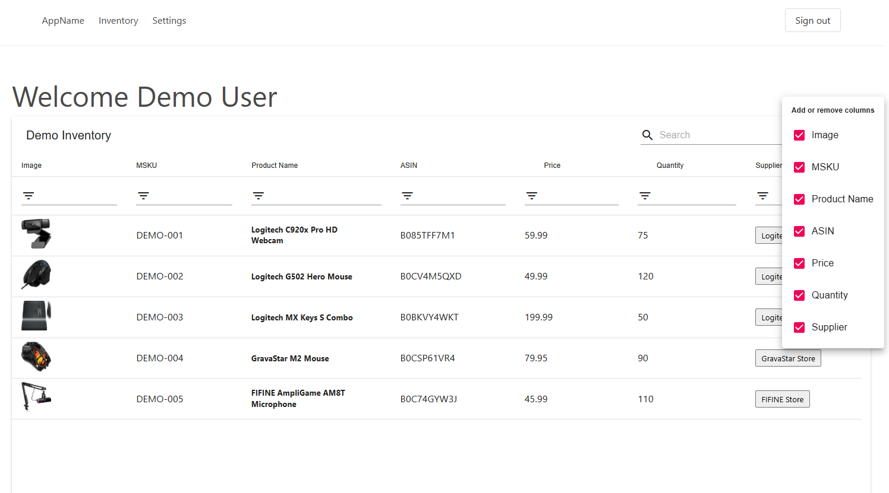

# Inventory Management App

A comprehensive inventory management application built with React, TypeScript, Redux, and Firebase to help businesses track and manage their product inventory efficiently.



## Features

- **User Authentication**: Secure email/password authentication with Firebase
- **Dashboard**: Overview of key inventory metrics
- **Inventory Management**: Add, edit, and delete inventory items with advanced filtering and search capabilities
- **Amazon Integration**: Import and sync inventory from Amazon seller accounts
- **Data Import**: Import inventory data from CSV files
- **Supplier Management**: Track and manage supplier information
- **Responsive Design**: Works on desktop and mobile devices

## Prerequisites

- Node.js (v12.0.0 or later)
- npm (v6.0.0 or later)
- A Firebase account for authentication, database, and cloud functions

## Installation

1. Clone the repository:
   ```bash
   git clone https://github.com/yourusername/inventory-app-v2.git
   cd inventory-app-v2
   ```

2. Install dependencies:
   ```bash
   npm install
   ```

3. Create a Firebase project:
   - Go to [Firebase Console](https://console.firebase.google.com/)
   - Click "Add Project" and follow the setup instructions
   - Register your app with Firebase (Web app)
   - Enable Authentication with Email/Password method
   - Set up Firestore Database

4. Create a `.env` file in the root directory with your Firebase configuration:
   ```
   REACT_APP_FIREBASE_API_KEY=your-api-key
   REACT_APP_FIREBASE_AUTH_DOMAIN=your-project.firebaseapp.com
   REACT_APP_FIREBASE_DB_URL=https://your-project.firebaseio.com
   REACT_APP_FIREBASE_PROJECT_ID=your-project-id
   REACT_APP_FIREBASE_STORAGE_BUCKET=your-project.appspot.com
   REACT_APP_FIREBASE_MESSAGING_SENDER_ID=your-messaging-sender-id
   REACT_APP_FIREBASE_APP_ID=your-app-id
   ```

## Running the Application

Start the development server:
```bash
npm start
```

The application will be available at http://localhost:3000

## Firebase Cloud Functions

This project uses Firebase Cloud Functions for server-side operations, particularly for Amazon API integration.

To set up and deploy Firebase functions:

1. Navigate to the functions directory:
   ```bash
   cd functions
   ```

2. Install dependencies:
   ```bash
   npm install
   ```

3. Setup credentials:
   - Create a service account for Firebase in your Google Cloud Console
   - Save the credential JSON as `functions/src/firebase/credentials.json`

4. Deploy the functions to Firebase:
   ```bash
   firebase deploy --only functions
   ```

### Firebase Function Features

- **Scheduled Tasks**: Runs every 5 minutes to process queued operations
- **Report Scheduler**: Daily scheduled task for fetching Amazon reports
- **Express API**: HTTP endpoints for interacting with Amazon MWS
- **Task Runner**: Background processing for Amazon data retrieval and synchronization

### Function Configuration

The application includes several Firebase Cloud Functions:
- `app`: Express API endpoints (memory: 1GB, timeout: 180 seconds)
- `taskRunner`: Scheduled task runner that executes every 5 minutes
- `requestReportScheduler`: Daily scheduled task for Amazon report retrieval

## Project Structure

```
inventory-app-v2/
├── public/                 # Static files
├── src/                    # Source code
│   ├── components/         # React components
│   │   ├── auth/           # Authentication components
│   │   ├── pages/          # Page components
│   │   ├── sections/       # Section components
│   │   └── UI/             # UI components
│   ├── firebase/           # Firebase configuration
│   ├── store/              # Redux store
│   │   ├── actions/        # Redux actions
│   │   └── reducers/       # Redux reducers
│   ├── App.tsx             # Main App component
│   └── index.tsx           # Entry point
├── functions/              # Firebase Cloud Functions
│   ├── src/                # Cloud Functions source code
│   │   ├── amazon/         # Amazon API integration
│   │   ├── express/        # Express API endpoints
│   │   └── firebase/       # Firebase services
│   └── lib/                # Compiled JavaScript
├── .env                    # Environment variables
├── .firebaserc             # Firebase project configuration
├── firebase.json           # Firebase deployment configuration
└── package.json            # Project dependencies
```

## Authentication

The app uses Firebase Authentication for user management. Users can:
- Register with email and password
- Login with existing credentials
- Reset password via email
- Update profile information

## Data Import

The application supports importing inventory data from CSV files.

### How to Import

1. Navigate to the "Import Data" page.
2. Drag and drop a CSV file onto the designated area or click to browse.
3. The application uses PapaParse to parse the CSV file.
4. Map the CSV columns to the corresponding inventory fields (e.g., MSKU, ASIN, Price, Quantity).
5. Review the imported data and confirm the import.

### CSV Format Requirements

- The CSV file should have headers in the first row.
- Ensure data types match the expected fields (e.g., numeric for Price and Quantity).

## Inventory Management

The main inventory view provides a table with the following features:
- Add new items
- Edit existing items
- Delete items
- Filter and search inventory
- Export data
- Column customization

## Amazon Integration

For sellers with Amazon accounts, the app can:
- Import inventory from Amazon seller accounts
- Sync stock levels
- Update product information
- Retrieve product images

### Setting Up Amazon MWS Integration

1. Create an Amazon MWS account and obtain the following credentials:
   - Seller ID
   - MWS Auth Token
   - AWS Access Key ID
   - Secret Key
   - Marketplace ID

2. Store these credentials in Firestore:
   ```
   users/[user_id]/amazon_credentials/{
     sellerId: "your-seller-id",
     mwsAuthToken: "your-mws-auth-token",
     accessKeyId: "your-access-key-id",
     secretKey: "your-secret-key",
     marketplaceId: "your-marketplace-id"
   }
   ```

3. The application will automatically use these credentials to fetch inventory data through scheduled Firebase functions.

### Amazon Report Types

The application can retrieve various Amazon report types:
- Active Listings Report
- FBA Inventory Report
- Order Reports
- Settlement Reports

Reports are fetched automatically via scheduled tasks and processed to update the inventory database.

## Development

### Available Scripts

- `npm start`: Runs the app in development mode
- `npm test`: Launches the test runner
- `npm run build`: Builds the app for production
- `npm run eject`: Ejects from create-react-app

### Technologies Used

- React 16.x
- TypeScript
- Redux for state management
- Firebase (Authentication, Firestore, Cloud Functions)
- Material-UI components
- React Router for navigation
- React Notifications Component
- Material Table for data display
- PapaParse for CSV parsing

## Deployment

### Web Application

1. Build the production version:
   ```bash
   npm run build
   ```

2. Deploy to Firebase Hosting:
   ```bash
   firebase deploy --only hosting
   ```

### Cloud Functions

Deploy Firebase functions:
```bash
cd functions
npm run deploy
```

## Contributing

1. Fork the repository
2. Create your feature branch (`git checkout -b feature/amazing-feature`)
3. Commit your changes (`git commit -m 'Add some amazing feature'`)
4. Push to the branch (`git push origin feature/amazing-feature`)
5. Open a Pull Request

## License

This project is licensed under the MIT License - see the LICENSE file for details.

## Acknowledgements

- [React](https://reactjs.org/)
- [Firebase](https://firebase.google.com/)
- [Redux](https://redux.js.org/)
- [Material-UI](https://material-ui.com/)
- [Material Table](https://material-table.com/)
